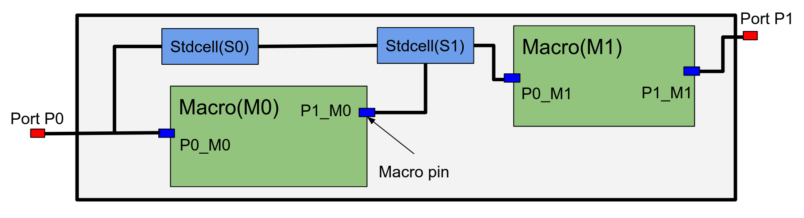
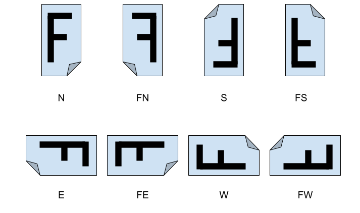

# Circuit Training Netlist Representation

Circuit Training uses the
[Tensorflow MetaGraphDef](https://github.com/tensorflow/tensorflow/blob/v2.8.0/tensorflow/core/protobuf/meta_graph.proto)
proto to exchange netlist information. Each node in the graph can represent
macros, standard cells, ports, and macro pins. You can find an example of the
netlist format for Ariane RISC-V CPU
[here](https://raw.githubusercontent.com/google-research/circuit_training/main/circuit_training/environment/test_data/ariane/netlist.pb.txt).

## Node types

Note: All the length fields are in microns.

### Macro

A macro is a relatively large rectangular block, representing a memory block, 
with the following fields defined:

-   name
-   attr
    -   `type`: Its placeholder value is set to `macro`
    -   `height`, `width`
    -   `x`, `y`: Coordinates of the center of the macro.
    -   `orientation`, one of `N`, `FN`, `S`, `FS`, `E`, `FE`, `W`, `FW`. (Note
        that 90 degree rotations are not allowed, if, for example, the initial
        orientation is one of N, FN, S, FS, then it can’t be changed to E, FE,
        W, or FW.)

#### Soft Macro

A standard cell cluster is treated as a "soft" macro and has the same attribute 
as normal macros. To distinguish them from memory blocks, soft macros' name 
starts with `Grp`.

### Standard Cell

A standard cell is a basic building block that implements a combinational or
sequential gate. The fields defined:

-   `name`
-   `input` : Repeated field that lists all nodes whose inputs are driven by the
    output of this cell. We are assuming (true for almost all the time) that
    there’s a single output of the standard cell.
-   `attr`
    -   `type`: Its placeholder value is set to `stdcell`
    -   `height`, `width`
    -   `x`, `y`: Coordinates.
    -   `weight`: Weight for the net this node is driving. Default value is 1.

### Port

A port is a dimensionless element that resides inside or on the edges of the
placement area. The fields:

-   `name`
-   `input` : Repeated field that lists all nodes that are driven by this port.
-   `attr`
    -   `type`: Its placeholder value is set to
    -   `port`
    -   `side`: One of `top`, `bottom`, `left`, `right`.
    -   `x`, `y`: Coordinates.
    -   `weight`: Weight for the net this node is driving. Default value is 1.

### Macro pin

A macro pin is a dimensionless element that is attached to a macro. Its position
is given relative to the center of the macro. The fields:

-   `name`
-   `input` : Repeated field that lists all nodes driven by this pin.
-   `attr`
    -   `type`: Its placeholder value is set to `macro_pin`
    -   `macro_name`: Name of the macro that this pin belongs to.
    -   `x_offset`, `y_offset`: Position relative to the center of the macro
        (according to normal placement).
    -   `x`, `y`: Coordinates (optional).
    -   `weight`: Weight for the net this node is driving. Default value is 1.
        If multiple std cells in a soft-macros drive std cells in another
        soft-macro, the weight will be larger than 1.

### Net

A net is implicitly defined by the `input` fields of the macro pins, standard
cells, and ports.

In case of soft macros (i.e., cluster standard cells) pins, the `weight`
attribute is used as a multiplier for the wirelength estimation. For example,
if N different wires in soft macro `Grp_a` are driving std cells in soft macro
`Grp_b`, the weight attribute of `Grp_a`’s pin is set to N.
